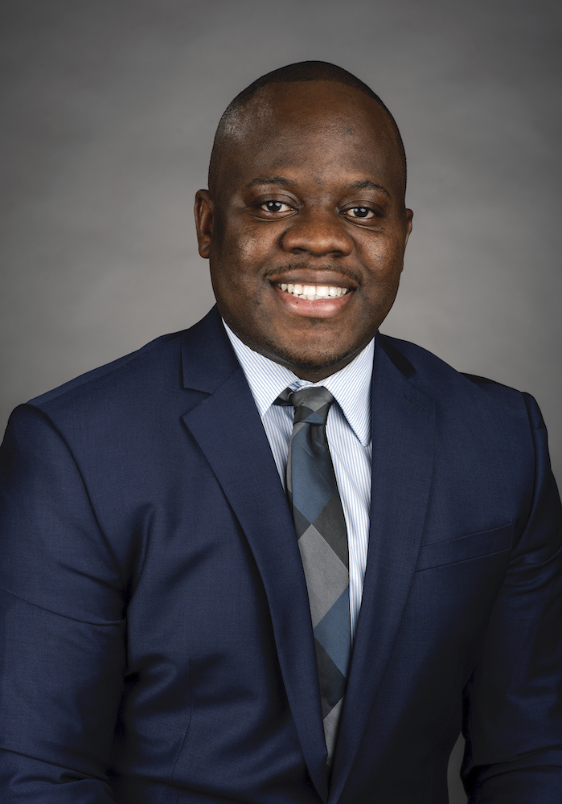

<figure>

</figure>

I hold a Ph.D. in Business (Actuarial Science) from the University of Wisconsin- Madison and obtained my master’s degree in Actuarial science from Illinois State University. I obtained my associate of the Society of Actuaries credential in December 2021. Since July 2020, I have served in the Department of [Mathematical Sciences](http://www.mathsci.appstate.edu) at [Appalachian State University](http://appstate.edu). I am married to Abigail, my beautiful and thoughtful wife, and we are blessed with two amazing boys, Jeremy and Jesse.

* * * 
